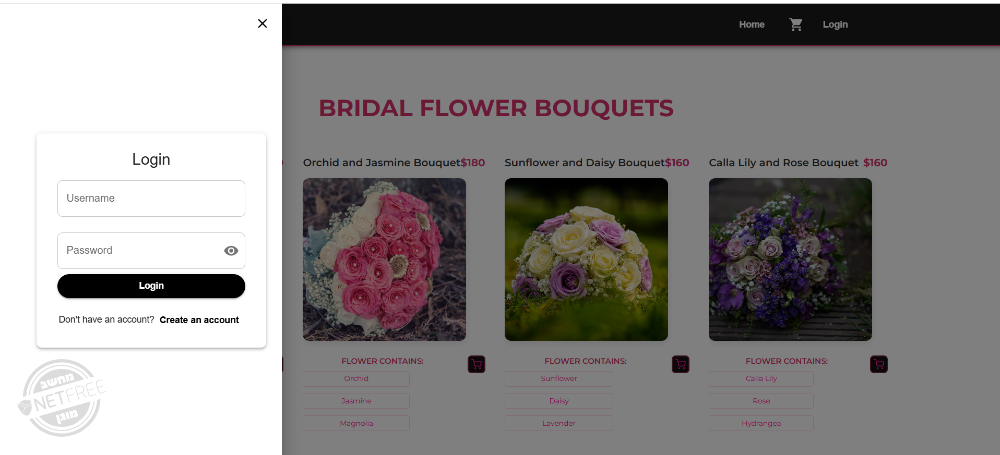
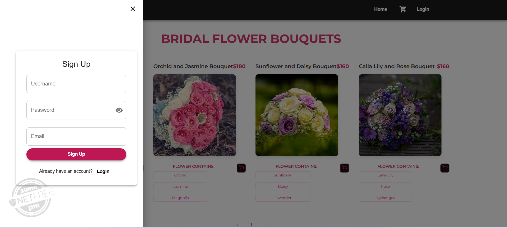
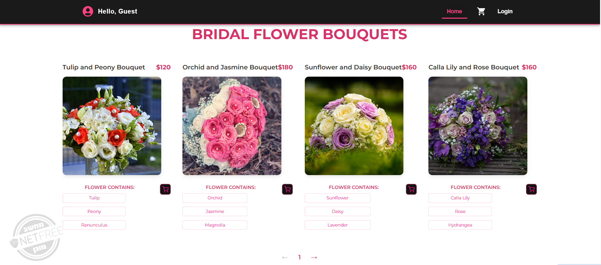
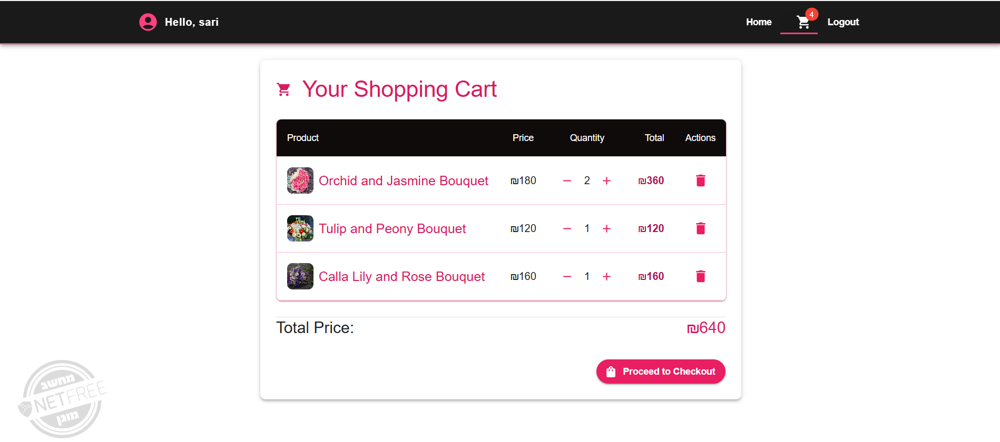
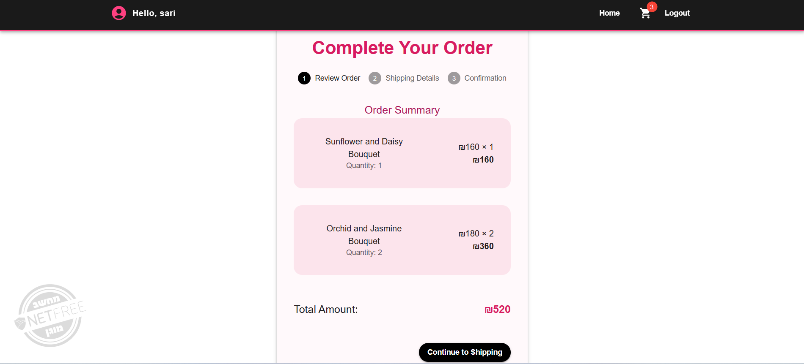
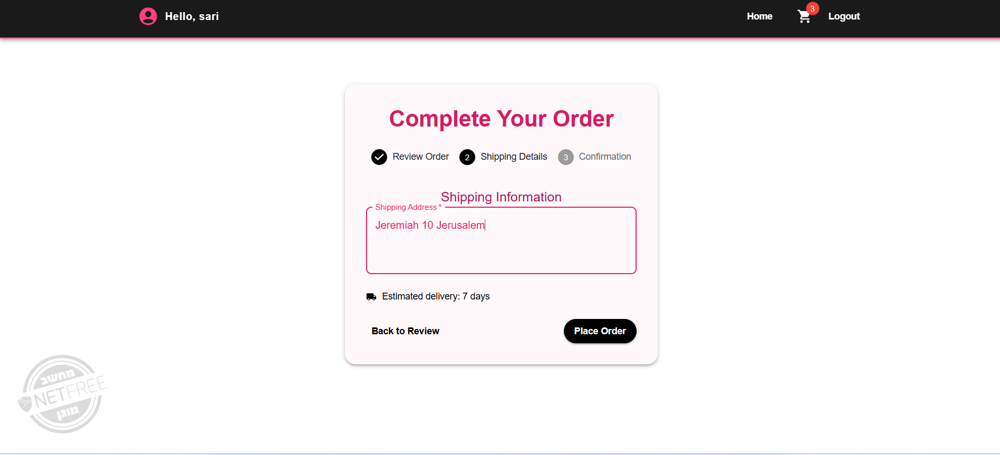
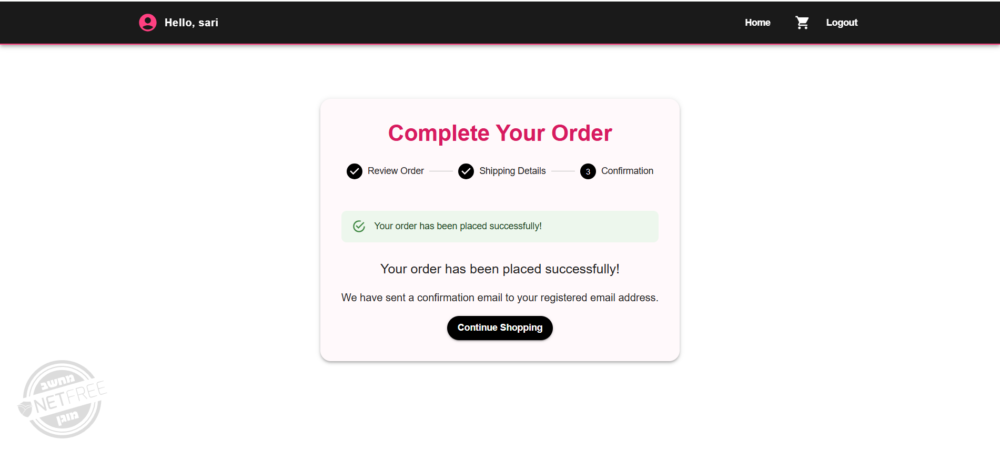
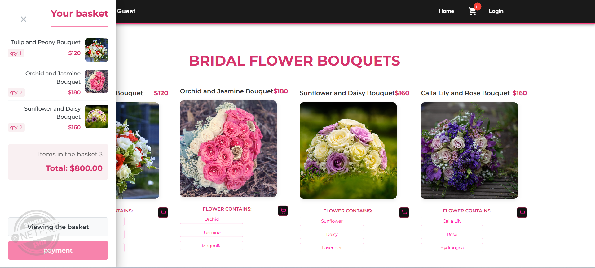
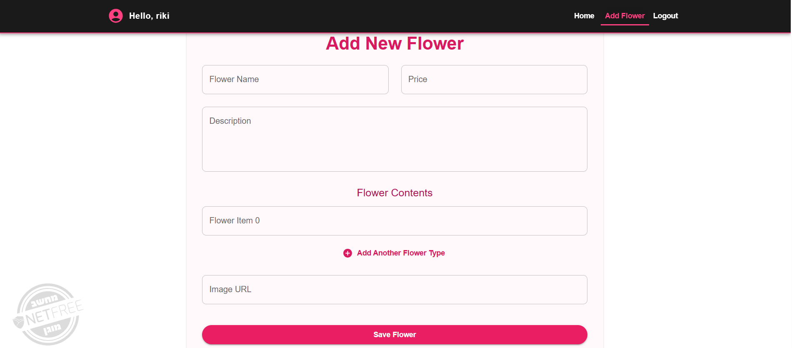

# Bouquet E-commerce Project

## Description
This project is an e-commerce website for purchasing flower bouquets, built with Node.js for the backend and React for the frontend. The application allows users to register, log in, browse products, manage a shopping cart, and place orders.

## Technologies Used
- **Frontend**: React, Material UI, Redux, Axios
- **Backend**: Node.js, Express, MongoDB, JWT, bcryptjs, Joi
- **Deployment**: Netlify for frontend, Atlas for MongoDB
- **State Management**: Redux
- **Form Handling**: Formik/React Hook Form
- **Routing Protection**: Protected Routes for user authentication

## Frontend Features
1. **Login Screen**: User can log in using their username and password.
 
2. **Registration Screen**: New user registration with data validation.
 
3. **Product List Screen**: Displays products with "Add to Cart" button for users and guests, "Delete" and "Update" buttons for admins.
 
4. **Shopping Cart Screen**: Displays all products added to the cart with quantity, price, and total. Users can modify quantities and remove items.
 

5. **Order Confirmation Screen**: Users input their shipping address and confirm the order. The order is saved on the server, and the current date and target date (1 week from now) are automatically set.
 
  
   
6. **Mini Cart Screen**: A mini version of the shopping cart that appears briefly when a product is added.
 
7. **Product Management (Admin)**: Admin can add, update, and delete products.

8. **Navbar**: Different navbars for different user roles (Admin, User, Guest).
9. **Features**: Additional custom feature added to enhance the user experience.

## Backend Features
- **Product Resource**: 
  - Get all products with pagination.
  - Get product by ID.
  - Add, update, and delete products.
- **User Resource**: 
  - Register new user and hash password.
  - Login user and validate credentials.
  - Get all users (admin only).
  - Update user details (excluding password).
  - Update password.
- **Order Resource**: 
  - Get all orders.
  - Place an order (only registered users).
  - Delete an order (only admin or the user who placed the order).
  - Get orders for a specific user.
  - Update order status (only admin).
  
## Installation

### Backend 
1. Clone the repository.
2. Navigate to the `server` folder.
3. Install dependencies:
  ```sh
   npm install
   ```
4. Run the development server:
  ```sh
  npm run dev
  ```
  
### Frontend
1. Clone the repository.
2. Navigate to the `client` folder.
3. Install dependencies:
   ```sh
   npm install
   ```
4. Run the development server:
  ```sh
  npm run dev 
  ```


Running the Project
After following the installation steps for both the frontend and backend, you can run the development servers for both parts of the project. Make sure to have both the frontend and backend servers running simultaneously for the project to work correctly.